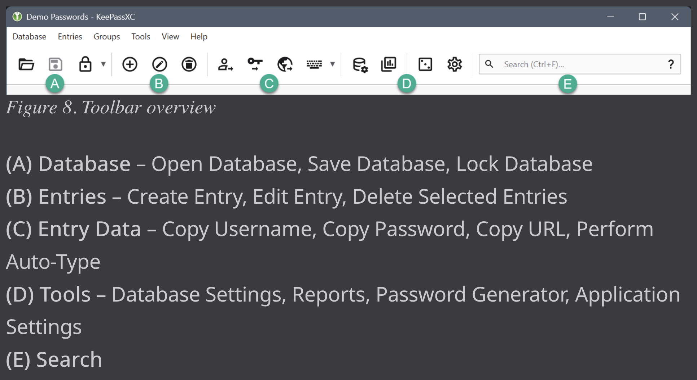

# KeePassXC Bedienung

#Keepassxc #Security

- Über Preview (unten rechts) kannst du auf Einträge zugreifen ohne sie öffnen zu müssen

## Toolbar
- Für die meisten Aktionen gibt es ein Icon in der Toolbar
- Icons in der Toolbar werden ausgegraut, wenn eine Aktion nicht möglich ist (z.B. wenn die Datenbank gesperrt ist)

